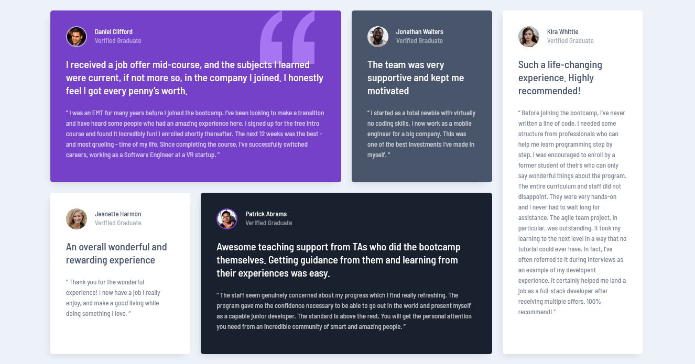

## Tabla de contenido

- [Resumen](#resumen)
  - [Captura de pantalla](#captura-pantalla)
  - [Enlaces](#enlaces)
- [Mi proceso](#mi-proceso)
  - [Construido con](#construido-con)
- [Autor](#autor)

## Vision en conjunto

### Captura de pantalla

### Enlaces

- URL de la solución: [https://github.com/hdlfkja/testimonios]
- URL del sitio en vivo: [https://cuadrilla-de-testimonios.netlify.app/]

## Mi proceso

### Construido con

- Marcado HTML5 semántico
- Propiedades personalizadas de CSS
- Caja flexible
- Cuadrícula CSS
- Flujo de trabajo móvil primero

## Autor

- Mentor de frontend - [@hdlfkja](https://www.frontendmentor.io/profile/tunombredeusuario)
- Twitter - [@JeanCar27866009](https://twitter.com/JeanCar27866009)
